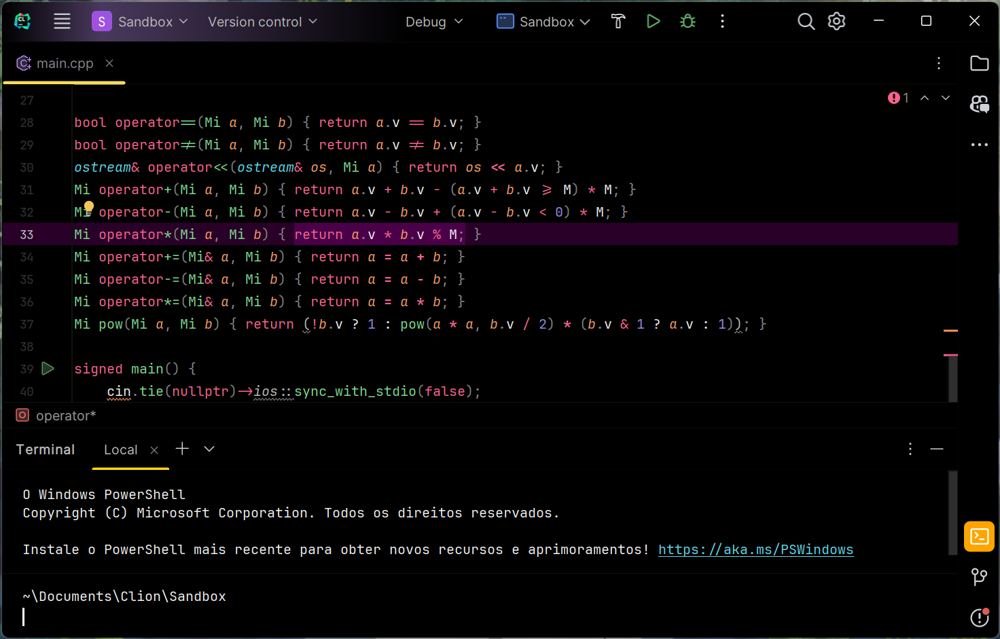
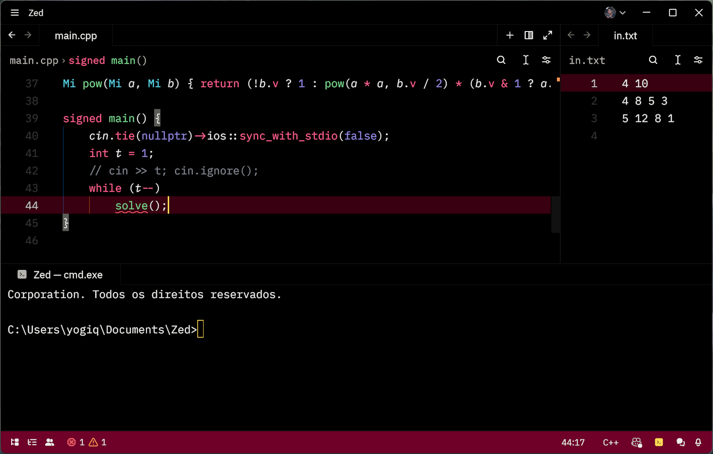

# Tema-YogiAmoled

Um tema amoled para as IDEs Jetbrains e Zed.

Baseado no tema <a href="https://plugins.jetbrains.com/plugin/13643-monokai-pro-theme">Monokai Pro</a>, mas com fundos totalmente pretos.

<h2>Para testar:</h2>

Instale o tema para as IDEs Jetbrains <a href="https://plugins.jetbrains.com/plugin/23863-yogi-amoled">aqui</a> ou pelo próprio editor na aba de plugins.

Instale o tema para o editor Zed na aba de extensões.

Feito por: Yogi Nam de Souza Barbosa

